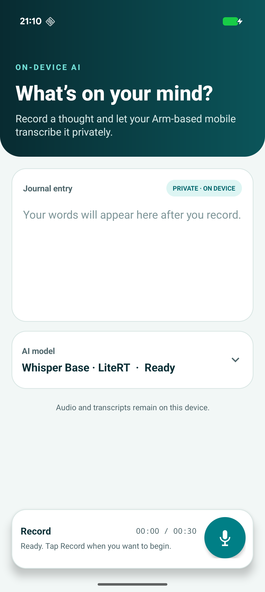

# Whisper Journal

Whisper Journal is a private, on-device speech-to-text sample for Arm64 Android devices. Record up to 30 seconds of speech, transcribe it locally, then copy, save, clear, or replace the journal entry.



The application keeps the journaling interface separate from model-specific inference. `ModelRegistry` lists compatible packages, `AdapterRegistry` selects the runtime, and one of two supplied adapters performs preprocessing, inference, and token decoding.

## Supported model packages

| Model | Runtime adapter | Package |
| --- | --- | --- |
| Whisper Tiny | ExecuTorch V2 | `whisper_tiny_executorch_v2.zip` |
| Whisper Small | ExecuTorch V2 | `whisper_small_executorch_v2.zip` |
| [Whisper Base INT8](https://huggingface.co/Arm/whisper-base-int8-litert) | LiteRT | `whisper-base-int8-litert.zip` |
| [Whisper Medium INT8](https://huggingface.co/Arm/whisper-medium-int8-litert) | LiteRT | `whisper-medium-int8-litert.zip` |
| [Whisper Large V3 INT8](https://huggingface.co/Arm/whisper-large-v3-int8-litert) | LiteRT | `whisper-large-v3-int8-litert.zip` |

The model weights are not included in this repository. The LiteRT Base package has been validated end to end on a physical Arm64 Android device. Medium, Large V3, and the supplied ExecuTorch V2 packages should be verified on the intended target device before publication.

## Build the application

Open this directory in Android Studio, allow Gradle to synchronize, connect an Arm64 device running Android 9 (API 28) or later, and run the `app` configuration.

The project uses Java 17, ExecuTorch 1.3.1, and LiteRT 2.1.6.

## Package a public LiteRT model

Install the Hugging Face Hub client and run the included downloader with one of the LiteRT repository IDs from the table:

```console
python -m pip install huggingface_hub
python download_model.py --repo-id Arm/whisper-base-int8-litert
```

The script downloads only the INT8 model and its tokenizer/configuration files, then creates `models/whisper-base-int8-litert.zip`. Copy that ZIP to the Android device.

## Transcribe a journal entry

1. Expand **Model settings** and select the matching model.
2. Tap **Import model package** and choose its ZIP file.
3. Tap **Record**, speak for up to 30 seconds, and tap **Stop**.
4. Copy, save, clear, or record the entry again.

Audio and transcripts remain on the device. The current adapters perform English transcription and keep only one model runtime loaded at a time.

## Application structure

- `MainActivity.java` owns the common journaling interface and background work.
- `ModelRegistry.java` describes the five compatible model packages.
- `AdapterRegistry.java` maps each descriptor to the ExecuTorch or LiteRT adapter.
- `ExecuTorchWhisperAdapter.java` runs the supplied Tiny and Small V2 packages.
- `litert/LiteRtWhisperAdapter.java` runs the Base, Medium, and Large V3 LiteRT exports.
- `ModelPackageImporter.java` validates and installs selected model ZIPs in private app storage.
